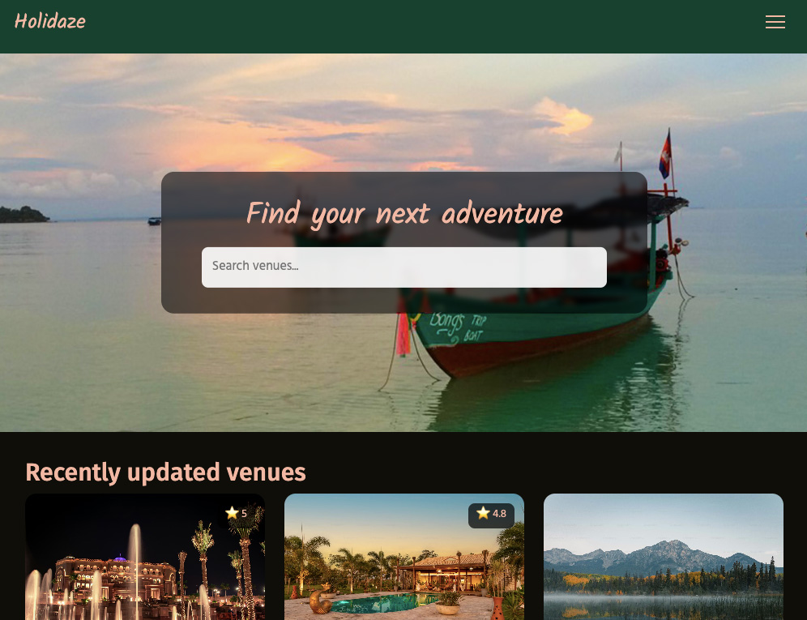

# Holidaze



Holidaze is a React-based web application for booking and managing venues for overnight stays.

This project was developed as the Project Exam 2 assignment during the Front-end Development program at Noroff.

Users can browse venues, view detailed venue information, register an account, and make bookings. Users can also register as Venue Managers, allowing them to create, update, and delete venues, as well as manage bookings for their venues.

---

## Features

### General User Features

- Browse and search available venues
- View detailed venue information
- Register and log in to an account
- Book venues through an availability calendar
- View upcoming and previous bookings
- Responsive design for mobile, tablet, and desktop

### Venue Manager Features

- Register as a Venue Manager
- Create new venues
- Edit and delete owned venues
- View bookings for owned venues

---

## Built With

- React (Create React App)
- JavaScript
- React Router
- Bootstrap
- Sass
- React Context API for authentication state management
- Yup form validation
- Noroff API v2

---

## API

This project uses the Noroff API v2.

Documentation: https://docs.noroff.dev/docs/v2

---

## Installation

1. Clone the repository

```bash
git clone https://github.com/VReinhaug/project-exam-2.git
```

2. Install dependencies

```bash
npm install
```

3. Create an .env file in the root directory and add:

REACT_APP_API_KEY=your_api_key

4. Start the development server

```bash
npm run start
```

Open http://localhost:3000 to view it in the browser.

---

## Hosted Site

The application is deployed on Netlify.

[https://exam2-veronika.netlify.app/](https://exam2-veronika.netlify.app/)

## Contact

[My LinkedIn Profile](https://www.linkedin.com/in/veronika-reinhaug/)
